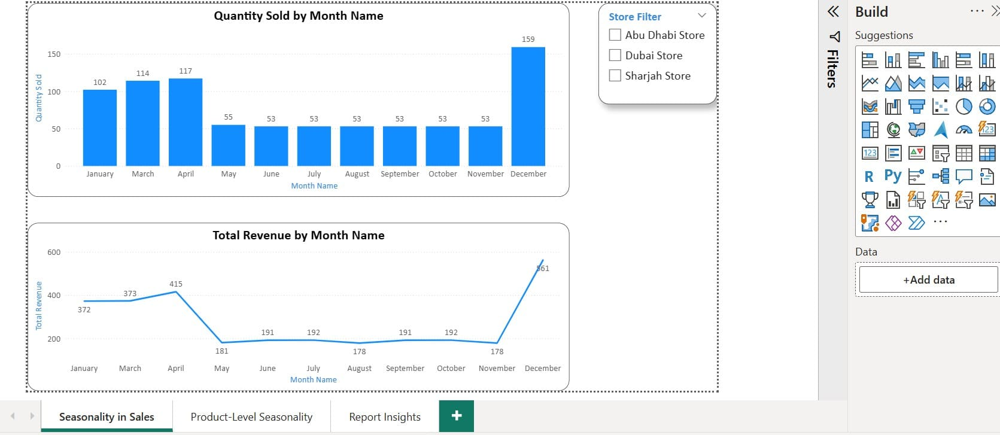
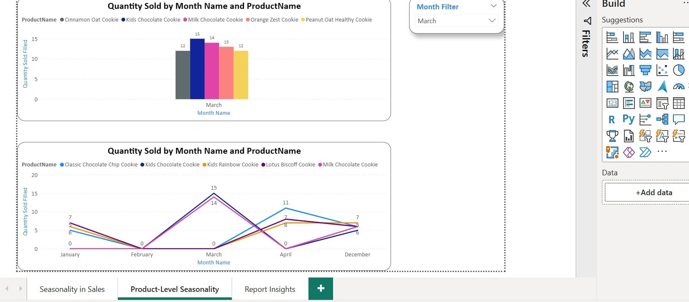
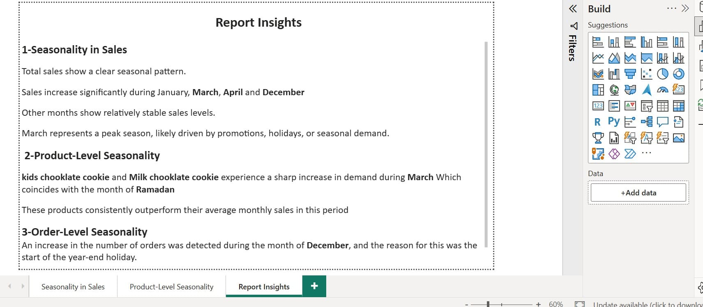
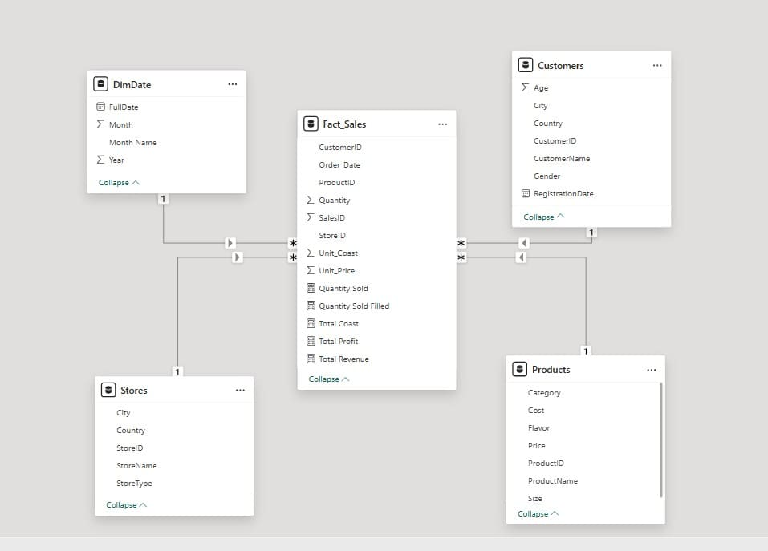

# Cookie Store Seasonality– Power BI

**Analyze sales patterns and seasonality to uncover peak months, product trends, and order-level insights.**

## 📌 Overview
This interactive Power BI dashboard analyzes sales seasonality and patterns to answer key business questions:  

- Which month has the highest sales?  
- Are there specific products that behave differently during certain months?  
- How do seasonal events impact orders and revenue?  

---

## 🔍 Key Insights

### 1️⃣ Seasonality in Sales
- Total sales show a clear seasonal pattern.  
- Sales increase significantly during January, March, April, and December.  
- March represents a peak season, likely driven by promotions, holidays, or seasonal demand.

### 2️⃣ Product-Level Seasonality
- **Kids Chocolate Cookie** and **Milk Chocolate Cookie** experience a sharp increase in demand during March (Ramadan).  
- These products consistently outperform their average monthly sales in this period.

### 3️⃣ Order-Level Seasonality
- Increase in number of orders detected during December due to year-end holidays.

---

## 🛠 Tools & Skills
- Power BI Desktop  
- Power Query  
- DAX  
- Data Modeling  

---

## 📂 Dataset
All data tables are included in the `Dataset` folder as an Excel file.

---

## 📷 Dashboard Preview
Here are screenshots of the dashboard:

---

## 📦 Full Project
A complete project file is available as a ZIP: `Project.zip`

